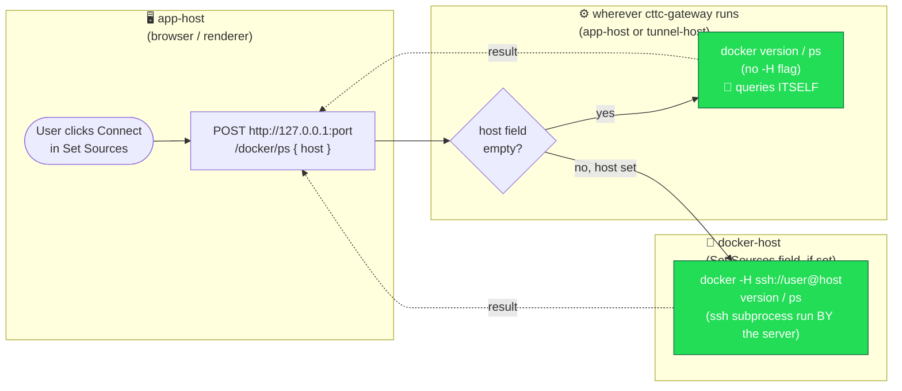
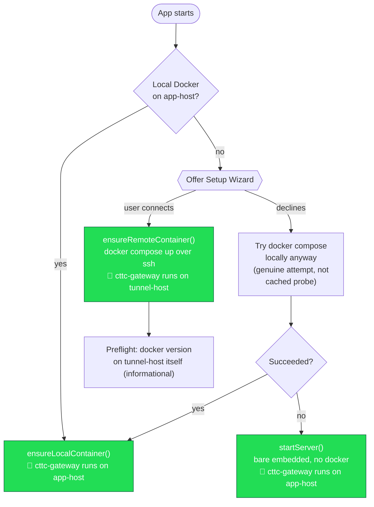

# Where cttc-gateway runs, and what "Docker host" actually targets

Three distinct systems come up when talking about Docker connectivity in
CTTC, and it's easy to conflate them:

- **app-host** — the machine running the Electron client.
- **tunnel-host** — the machine the setup wizard's ssh tunnel connects to
  (only exists in ssh-tunnel mode); this is where the `cttc-gateway`
  container actually runs in that mode.
- **docker-host** — whatever's typed into Set Sources' "Docker host" field
  (`ssh://user@host`, or bare `user@host`); may be empty.

The one invariant that holds no matter what: **the browser/renderer only
ever talks to `http://127.0.0.1:<port>`** — wherever `cttc-gateway` itself
lives (app-host or tunnel-host). The Docker host field is just a string in
the JSON body of that request; it's `server.py`, running on whichever host
`cttc-gateway` is on, that turns it into `docker -H ssh://user@host ...` and
does the actual ssh connection to docker-host. The client never opens a
connection to docker-host itself (`fetch()` can't even speak `ssh://`).

## Getting docker info: the request journey (swimlane)

Strictly left to right — each step in getting docker info moves one lane
further right; nothing loops backward except the final result:

## Where cttc-gateway ends up running (startup decision)

This part happens once, at app startup, before any Set Sources request is
ever made — it decides which system lane 2 above actually is:

## Business rules this encodes

1. On first launch, if app-host has no local Docker, CTTC offers the setup
   wizard (connect to a tunnel-host instead).
2. Declining the wizard (Skip, or just closing it) doesn't crash the app —
   it makes a genuine attempt at `docker compose up` on app-host anyway
   (the earlier "no local Docker" probe can be wrong, e.g. a daemon still
   starting up), falling back to a bare, docker-less embedded server only
   if that attempt itself fails.
3. A successful tunnel connection deploys `cttc-gateway` onto tunnel-host,
   then immediately probes whether *that* host has Docker (informational —
   doesn't block setup either way).
4. In Set Sources, an empty "Docker host" field resolves to wherever
   `cttc-gateway` actually runs (app-host or tunnel-host, whichever
   applies); a non-empty field overrides that with an explicit docker-host,
   reached via ssh **from the server**, never from the browser.

See also: [remote-server.md](remote-server.md) for the original SSH-tunnel
design (note: that doc still describes the now-removed encryption-keys
feature and is due a broader rewrite).
