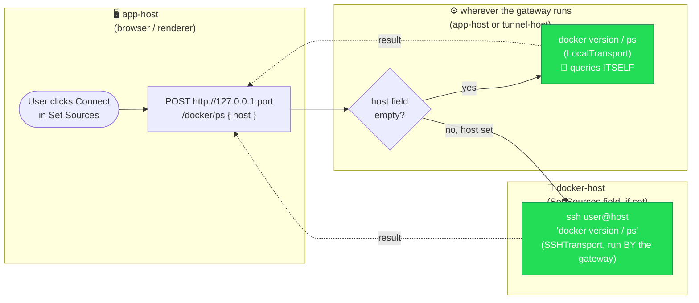
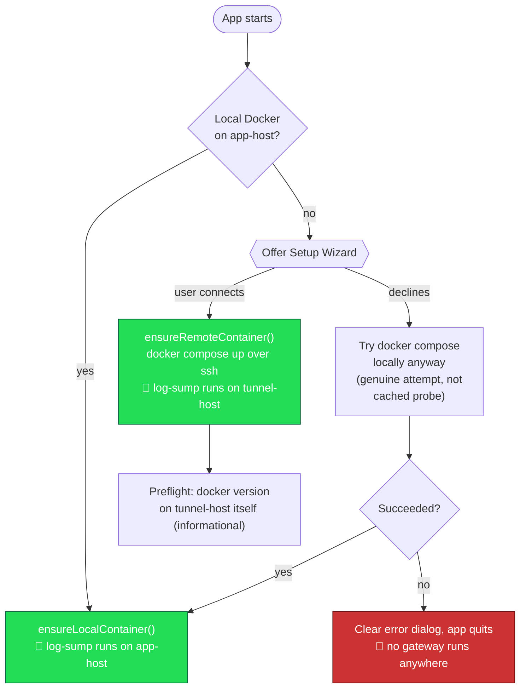

# Where the gateway runs, and what "Docker host" actually targets

Three distinct systems come up when talking about Docker connectivity in
CTTC, and it's easy to conflate them:

- **app-host** — the machine running the Electron client.
- **tunnel-host** — the machine the gateway setup's ssh tunnel connects to
  (only exists in ssh-tunnel mode); this is where the **log-sump** gateway
  container actually runs in that mode.
- **docker-host** — whatever's typed into Set Sources' "Docker host" field
  (`ssh://user@host`, or bare `user@host`); may be empty.

The one invariant that holds no matter what: **the browser/renderer only
ever talks to `http://127.0.0.1:<port>`** — wherever the log-sump gateway
itself lives (app-host or tunnel-host). The Docker host field is just a
string in the JSON body of that request; it's the gateway (log-sump-plugin's
`compat.py`, translating it into a daemon registration that log-sump's own
`SSHTransport` then runs `ssh user@host "docker ..."` against) that turns it
into an actual ssh connection to docker-host. The client never opens a
connection to docker-host itself (`fetch()` can't even speak `ssh://`).

## Getting docker info: the request journey (swimlane)

Strictly left to right — each step in getting docker info moves one lane
further right; nothing loops backward except the final result:

```mermaid
flowchart LR
    subgraph L1["🖥️ app-host<br/>(browser / renderer)"]
        direction TB
        S1(["User clicks Connect<br/>in Set Sources"]) --> S2["POST http://127.0.0.1:port<br/>/docker/ps { host }"]
    end

    subgraph L2["⚙️ wherever the gateway runs<br/>(app-host or tunnel-host)"]
        direction TB
        S3{"host field<br/>empty?"}
        S4["docker version / ps<br/>(LocalTransport)<br/>📍 queries ITSELF"]
        S3 -- "yes" --> S4
    end

    subgraph L3["🎯 docker-host<br/>(Set Sources field, if set)"]
        direction TB
        S5["ssh user@host<br/>'docker version / ps'<br/>(SSHTransport, run BY the gateway)"]
    end

    S2 --> S3
    S3 -- "no, host set" --> S5
    S4 -. result .-> S2
    S5 -. result .-> S2

    classDef here fill:#2d5,stroke:#164,color:#fff
    class S4,S5 here
```

## Where the gateway ends up running (startup decision)

This part happens once, at app startup, before any Set Sources request is
ever made — it decides which system lane 2 above actually is. Docker is
required unconditionally now (see `app/main.js`'s `connectToServer`): there
is no bare/non-Docker fallback left to fall through to.

```mermaid
flowchart TB
    A1([App starts]) --> A2{Local Docker<br/>on app-host?}
    A2 -- yes --> A3["ensureLocalContainer()<br/>📍 log-sump runs on app-host"]
    A2 -- no --> A4{{Offer Setup Wizard}}
    A4 -- "user connects" --> T1["ensureRemoteContainer()<br/>docker compose up over ssh<br/>📍 log-sump runs on tunnel-host"]
    T1 --> T2["Preflight: docker version<br/>on tunnel-host itself (informational)"]
    A4 -- declines --> A5["Try docker compose<br/>locally anyway<br/>(genuine attempt, not<br/>cached probe)"]
    A5 --> A7{Succeeded?}
    A7 -- yes --> A3
    A7 -- no --> A9["Clear error dialog, app quits<br/>📍 no gateway runs anywhere"]

    classDef server fill:#2d5,stroke:#164,color:#fff
    classDef fail fill:#c33,stroke:#611,color:#fff
    class A3,T1 server
    class A9 fail
```

## Business rules this encodes

1. On first launch, if app-host has no local Docker, CTTC offers the setup
   gateway setup (connect to a tunnel-host instead).
2. Declining the gateway setup (Skip, or just closing it) doesn't crash the app —
   it makes a genuine attempt at `docker compose up` on app-host anyway
   (the earlier "no local Docker" probe can be wrong, e.g. a daemon still
   starting up). If that attempt also fails, there is no fallback left: a
   clear error dialog surfaces and the app quits (see
   `.claude/plans/sprightly-stirring-blum.md`'s Phase 10 — the old bare,
   docker-less embedded server was decommissioned along with `app/server`).
3. A successful tunnel connection deploys the log-sump gateway onto
   tunnel-host, then immediately probes whether *that* host has Docker
   (informational — doesn't block setup either way).
4. In Set Sources, an empty "Docker host" field resolves to wherever the
   gateway actually runs (app-host or tunnel-host, whichever applies); a
   non-empty field overrides that with an explicit docker-host, reached via
   ssh **from the gateway**, never from the browser.

See also: [remote-server.md](remote-server.md) for the SSH-tunnel/remote
deployment design.
