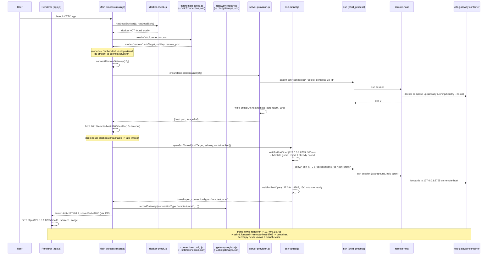
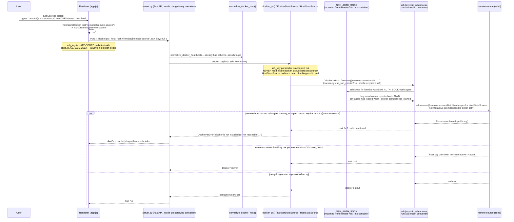

<!-- title: CTTC Remote Connectivity — Call Trace -->

# CTTC remote connectivity: call trace and why the tunnel isn't working

> **⚠️ ARCHIVED — describes the pre-migration `app/server` architecture.**
> `app/server` (including every `server.py`/`docker_ps`/`HostStatsSource`/
> `ensure_ssh_identity` reference below) was decommissioned in favor of the
> log-sump-based gateway (see `.claude/plans/sprightly-stirring-blum.md`'s
> Phase 10) — none of the code paths this doc traces exist anymore. Kept for
> historical record of the investigation and fix described below, **not**
> as a description of current behavior.
>
> **The current equivalent**: `app/log-sump-plugin/src/log_sump_plugin/`
> (`routes.py`'s `/docker/ps`/`/docker/collect`, `compat.py`'s
> `register_or_get_daemon`/`preview_containers`/`collect`), which
> translates a Set Sources docker-host string into a daemon registration
> that log-sump's own `SSHTransport` (`app/server-logsump/src/log_sump/common/transport.py`)
> runs as `ssh user@host "docker ..."`. The gateway container's ambient
> `SSH_AUTH_SOCK` forwarding (same mount shape as described below) is still
> the mechanism today. **The exact `ssh_key` dead-plumbing bug this
> document is about has been reintroduced in that new code** — the request
> models still declare `ssh_key`, but nothing between the route handler and
> `register_or_get_daemon` actually threads it through (`register_or_get_daemon`
> has no parameter for it at all) — see `BUG-0099`/`br-PLUG-003`. The
> renderer's docker-host module (`app/renderer/src/modules/docker-host/`)
> also no longer has any SSH-key-picker UI at all, unlike what this
> document's "what's been fixed" section describes.
>
> Original status note, describing the state as of the last time `app/server`
> actually had this bug fixed: the `ssh_key` dead-plumbing bug described in
> Scenario 2 was fixed — `HostStatsSource` passed `-i <key> -o
> IdentitiesOnly=yes` directly, `docker_ps`/`docker_client`/`DockerLogSource`
> got the same pinning via a managed per-host `ssh_config` stanza
> (`ensure_ssh_identity()` in `server.py`), and the renderer's "Set Sources"
> dialog had a real key picker instead of hardcoding `ssh_key: null`. The
> analysis below is kept as-is as the record of what was wrong and why; see
> the bottom of the "Why this is always failing" section for what changed
> (in `app/server`, since removed).

Two things are being conflated under "remote tunnel," and that distinction is the root of the failure. CTTC has **two independent SSH surfaces**:

1. **Gateway connection** — how the Electron client on `localhost` reaches the log-sump gateway container on `remote-host`. This is what `app/lib/ssh-tunnel.js` + `app/lib/server-provision.js` implement. It's per-source, username-correct, and — per your setup — already working (`cttc-container running and healthy`).
2. **"Set Sources" Docker-host telemetry** — a *second, independent* SSH hop that the CTTC **server itself** (running inside the gateway container, wherever that container lives) makes outward to a third machine, to run `docker ps`/`docker stats`/`/proc` reads there. This is the feature you're describing: *"an API call should trigger docker calls in the python server, querying the remote source system, bypassing the missing local Docker instance."* This is where `remote-source` / `remoto` lives, and this is the one that's broken.

---

## The full picture: `local` vs `remote` vs `remote-tunnel`

Every gateway CTTC ever connects to is recorded with exactly one of three `connectionType` values (`app/lib/gateway-registry.js`). This is decided once, at connect time, by `connectToServer()`/`connectRemoteGateway()` in `main.js`. This part of the doc is **not archived** — the three-way classification is still current; only the deep-dive Scenario 2 walkthrough below traces the now-removed `app/server`. The renderer only ever sees `http://<serverHost>:<serverPort>`; it cannot tell them apart.

| `connectionType` | When it happens | Client traffic | SSH involved? |
|---|---|---|---|
| **`local`** | `cfg.mode === "embedded"` — the default, no `~/.cttc/connection.json`. `ensureLocalContainer()` runs the log-sump gateway container on `127.0.0.1`. Docker is required unconditionally now — there is no non-Docker fallback (`app/server`'s bare `uv run server.py` path was decommissioned, see `.claude/plans/sprightly-stirring-blum.md`'s Phase 10); a missing/failed Docker surfaces as a clear error instead. | `http://127.0.0.1:<port>` directly | No — nothing to SSH to |
| **`remote`** | `cfg.mode === "remote"` (from `connection.json`/env) **and** the gateway answered a direct HTTP `/health` probe (`main.js` `connectRemoteGateway`, the `!forceTunnel` branch). The gateway container is reachable on the network as-is. | `http://<remote-host>:<port>` directly, from the Electron client itself | Only once, up front, to *provision* (`ensureRemoteContainer` → `docker compose up` over ssh) — never for the ongoing request/response traffic |
| **`remote-tunnel`** | Same starting point as `remote`, but the direct `/health` probe failed/timed out (firewalled, no route, etc.) — or the gateway is already known (`forceTunnel: alreadyKnown` at `switch-gateway`, skipping the probe). | `http://127.0.0.1:<port>` from the Electron client — but that port is the **local end of an `ssh -L` forward**, not a real local server | Continuously — an `ssh -N -L` process is held open for as long as the gateway is active (`ssh-tunnel.js`) |

```mermaid
sequenceDiagram
    participant U as User
    participant M as Main process (main.js)
    participant CFG as connection-config.js
    participant DC as docker-check.js
    participant SP as server-provision.js (ssh, one-time provision)
    participant TUN as ssh-tunnel.js
    participant GW as log-sump gateway container

    U->>M: launch CTTC.app
    M->>CFG: loadConnectionConfig()
    alt cfg.mode === "embedded" (no connection.json)
        M->>DC: hasLocalDocker()?
        alt Docker present locally
            M->>GW: ensureLocalContainer() -- docker compose up on 127.0.0.1
        else no local Docker
            M->>M: clear error dialog, app quits -- no fallback
        end
        Note over M: connectionType = "local"<br/>serverHost=127.0.0.1, serverPort=<port>
    else cfg.mode === "remote" (connection.json: sshTarget, sshKey, remote_port)
        M->>SP: ensureRemoteContainer(cfg) -- ssh: docker compose up (idempotent)
        SP->>GW: provisioned/confirmed healthy on remote-host
        M->>M: fetch http://remote-host:remote_port/health (10s)
        alt direct HTTP reachable
            Note over M: connectionType = "remote"<br/>serverHost=remote-host, serverPort=remote_port<br/>(no tunnel; ssh only used just now, for provisioning)
        else unreachable / already-known gateway (forceTunnel)
            M->>TUN: openSshTunnel({sshTarget, sshKey, containerPort})
            TUN->>GW: ssh -N -L 127.0.0.1:port:localhost:port <sshTarget> (held open)
            Note over M: connectionType = "remote-tunnel"<br/>serverHost=127.0.0.1, serverPort=<port><br/>(real traffic: renderer -> tunnel -> remote-host -> container)
        end
    end
```

Whichever branch runs, `serverConnectionType` gets stamped and persisted via `recordGateway()` (`gateway-registry.js`), and the "Set Sources" flow from Scenario 2 below behaves **identically regardless of which of the three is active** — it's a second, independent hop that `server.py` makes outward from wherever it's actually running (the `local` container, the `remote` container, or the far end of the `remote-tunnel`), not something the client orchestrates.

---

## Scenario 1 — startup, no local Docker, gateway reachable only via SSH tunnel to `remote-host`



**This path uses one username** — `sshTarget = "<sshUser>@<sshHost>"` — built once in the New-Gateway / wizard dialog and stored verbatim in `gateways.json`. It is passed unmodified into every `ssh`/`scp` invocation (`ssh-tunnel.js:27`, `server-provision.js:89`). There's no cross-source leakage here: this is not where your `remoto` problem lives.

---

## Scenario 2 — "Set Sources" pointing at `remote-source` (user `remoto`)

This is a *server-side* SSH hop, not a client-side tunnel. It happens after Scenario 1 has already succeeded — the renderer is already talking to `server.py` (whether directly or through the tunnel makes no difference here).



### Why this is "always" failing

The mount that's supposed to carry credentials is in `app/server/docker-compose.yml` / `docker-compose.deploy.yml` / `docker-compose.registry.yml`:

```yaml
environment:
  - SSH_AUTH_SOCK=/ssh-agent
volumes:
  - ${SSH_AUTH_SOCK:-/dev/null}:/ssh-agent
```

Chain of requirements, every one of which is a silent, non-interactive failure point (no password prompt is possible anywhere in this path):

1. **The identity comes from `remote-host`, not from anywhere you configure in the UI.** The container mounts whatever `SSH_AUTH_SOCK` `remote-host`'s shell had exported *at the moment `docker compose up` was run*. If `remote-host` has no `ssh-agent` running, the compose file falls back to mounting `/dev/null` — a guaranteed no-op — and every `ssh` call from inside the container has zero identities available.
2. **The `ssh_key` field is dead code.** `list_ssh_keys()` / the `/ssh-keys` route exist in `server.py`, and `ssh_key` is threaded as a parameter through `docker_ps`, `DockerStatsSource`, `HostStatsSource` — but the renderer never calls `/ssh-keys` and always sends `ssh_key: null` (`app/renderer/app.js:755`, `1035`, `2513`). Even inside those functions, `ssh_key` is accepted and then never referenced again — there's no `-i <key>` ever added to any `ssh`/`docker -H` invocation. Whatever a user picks or types has no effect; only `remote-host`'s ambient agent matters.
3. **`remote-source` must already be a trusted host on `remote-host`**, i.e. present in `remote-host`'s `~/.ssh/known_hosts` (whatever user the container's ssh-agent-forwarding was set up under). Since these SSH calls run non-interactively (`BatchMode=yes` in `HostStatsSource`; docker-py's ssh transport is equally non-interactive), an unknown host key aborts immediately rather than prompting.
4. **One free-text field, no username field.** Unlike the gateway dialog (separate `sshUser`/`sshHost` inputs), "Set Sources" is a single text box (`index.html:240`, placeholder `user@host`). If `remoto` is only typed as `remote-source` without the `remoto@` prefix, the container (running **as root** — no `USER` in `app/server/Dockerfile`) will attempt `root@remote-source`, which fails immediately on any host with the standard `PermitRootLogin no`/no root key trusted.

**What's been fixed since this was written** (bullets 1 and 2 above):
- The "Set Sources" dialog now has a real "SSH key" field + file browser (`index.html`, `app.js`) instead of hardcoding `ssh_key: null` — it's sent on `/docker/ps` and `/docker/collect`, remembered per host (`dockerHostKeys` map) for follow-up calls that don't have the dialog open, and persisted/replayed across restarts via the existing `lastDockerSessions` mechanism.
- `HostStatsSource` now adds `-i <ssh_key> -o IdentitiesOnly=yes` to its own hand-built ssh command when a key is given.
- `docker_ps`/`docker_client`/`DockerLogSource` — which shell out to the `docker` CLI / docker-py's `use_ssh_client` transport and have no per-call `-i` flag to use — get the same pinning indirectly: `ensure_ssh_identity()` (`server.py`) writes a managed `Host <hostname>` stanza with `IdentityFile`/`IdentitiesOnly yes` into `/etc/ssh/ssh_config.d/50-cttc-sources.conf` (included automatically per the base image's `ssh_config`) before either route touches the connection.
- Bullet 3 (host-key trust) was already handled correctly (`StrictHostKeyChecking accept-new`, `Dockerfile:62-63`) — not a real gap, just something to be aware of on first contact with a new host.
- Bullet 4 (username must be typed as part of the free-text field) is unchanged — still worth double-checking on a fresh failure.

### What to check on `remote-host`, in order

1. Is an `ssh-agent` actually running on `remote-host`, and was `SSH_AUTH_SOCK` exported in the shell that ran `docker compose up` for the gateway container? (Restarting/recreating the container is required after fixing this — the mount is fixed at container-create time, not live.)
2. Does that agent have `remoto`'s private key loaded — `ssh-add -l` on `remote-host`, run as whichever user launched the container?
3. From `remote-host` directly (not through CTTC): `ssh -o BatchMode=yes remoto@remote-source true` — this reproduces exactly what the container does. If this fails, nothing in the app can fix it; it's a host-level SSH auth problem.
4. Is `remote-source`'s host key already in `remote-host`'s `known_hosts` for the user whose agent is forwarded?
5. In the "Set Sources" field, confirm the exact text is `remoto@remote-source`, not just `remote-source`.
6. Read the activity log / returned `log` array from `/docker/ps` — `DockerPsError` bundles the literal `ssh`/`docker` stderr (`server.py:637-668`), which will say `Permission denied (publickey)` vs. a host-key/network error and immediately tell you which of the above it is.
