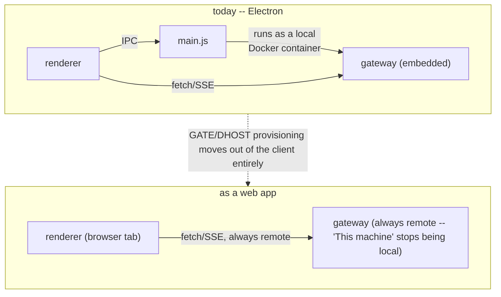

# Domain-driven renderer refactor, and whether cttc could be a web app

**Status:** design only, nothing implemented. Written after auditing the
current renderer against catalyst's own 33 inferred domains
(`.catalyst-proj/domains/domains.md`) and against
[Ray 3.0's published architecture](https://myray.app/blog/ray-architecture)
(also an Electron app choosing "single codebase, multiple OSes").

> **Note (2026-08-15):** `app/server` (`server.py`) referenced throughout
> below was decommissioned after this doc was written, replaced by the
> log-sump-based gateway (`app/server-logsump` + `app/log-sump-plugin`) --
> see `.claude/plans/sprightly-stirring-blum.md`'s Phase 10. The
> three-layer structural analysis (renderer / main / server) and the
> web-app feasibility conclusions below are unaffected; only the specific
> file/line-count references and the "spawns server.py as a child process"
> embedded-mode mechanism are stale (embedded mode now always runs the
> gateway as a Docker container, never a bare child process). The `server.py
> -- 11 business domains` breakdown (`REDIS`/`DEDUP`/`AUTO`/`RECS`/`EVTO`/
> `SCHED`/`RBUF`/`QUEUE`/`BUCKET`/`SEG`/`ORPHAN`) was that catalyst rule
> catalog's own domain split for the now-removed code -- it has not been
> re-derived for the new backend's actual domain boundaries.

## Where the renderer stands today

The renderer is vanilla JS against the DOM -- a `$(id)` helper, direct
`element.hidden`/`.textContent` writes, and a small set of hand-called
re-sync functions (`refreshAll()`, `drawAll()`, `syncRecordingMenu()`,
`populateOpenedDataList()`...) that every state mutation has to remember to
invoke, in the right order, or a panel silently goes stale. There's no
build step, no framework, no package beyond Electron itself.

| | Lines | Notes |
|---|---|---|
| [`app/renderer/app.js`](../../app/renderer/app.js) | 6,548 | one global `state` object, ~35 preload IPC calls scattered inline |
| [`app/main.js`](../../app/main.js) | 1,941 | Node/Electron main process |
| [`app/server-logsump`](../../app/server-logsump) + [`app/log-sump-plugin`](../../app/log-sump-plugin) | n/a (separate repos/submodules) | Redis-backed telemetry store, its own process (was `app/server/server.py`, 3,304 lines, before the log-sump migration) |
| Runtime dependencies | 0 | Electron + electron-builder only, both dev-only |

The file is not actually disorganized -- it's *unseparated*. It carries 47
hand-written section dividers (`/* -- recording -- */`, `/* -- gateway
dropdown -- */`...) that already trace almost exactly onto the 13 UI
domains catalyst independently inferred from the same code. A developer
reading it top to bottom is already reading it domain-by-domain; the
domains just aren't *files* yet.

Three processes, three concerns:

| Layer | File | Owns | Talks to renderer via |
|---|---|---|---|
| Renderer | `renderer/app.js` | All 13 UI domains: charts, log panels, dialogs, sidebar, recording controls, event editor | -- |
| Main (Electron/Node) | `main.js` | Gateway provisioning (SSH/Docker), window & menu management, native dialogs, local persistence | contextBridge / IPC (`preload.js`) |
| Server (Python) | `server-logsump` + `log-sump-plugin` | Redis-backed telemetry store, collection, event orchestration, recording sessions | HTTP + SSE (`fetch`, no Electron API) |

That third row matters more than it looks. The renderer's actual data
plane -- `/range`, `/series`, `/sources`, `/docker/*`, `/events/*`,
`/sample/*` -- is already a plain JSON API call, with zero Electron surface
in the request path. See "Toying with a true web app" below for why that's
the whole ballgame for the web-app question.

## What Ray 3.0 does that's worth borrowing

Ray is also an Electron app choosing "single codebase, multiple OSes" for
the same reason cttc did. Four ideas transfer directly; one (the rendering
framework) is a real trade-off, not a straight copy.

| Ray's pattern | Shape | Problem it solves in cttc today |
|---|---|---|
| Modular hub | One folder per domain; each owns its own components, types, and store | 47 comment dividers become 13 real module boundaries -- a merge conflict in "recording" can no longer touch "charts" |
| Atom-per-concern store | Read-only/derived atoms in a state file, setters isolated in `.actions.ts` | Replaces the single `state` object + manually-sequenced `refreshAll()/drawAll()/syncRecordingMenu()` calls with subscriptions -- a panel re-renders because its own atom changed, not because someone remembered to call the right function |
| `shared/` for context-agnostic code | Types, helpers, utilities usable by every module | Already exists in spirit -- the `FMT` domain (color/formatting helpers) is exactly this, just not yet its own folder |
| `structures/` (classes, factories) | Foundational building blocks -- e.g. a `ChartRenderer` class, a connection factory | cttc's chart/log-panel drawing code is already class-shaped in practice (canvas renderers, virtual-scroll panels) -- this gives it a proper home instead of living inline in app.js |
| React + component files | Main component + subcomponents + context + CVA variants, per complex UI piece | Real trade-off -- see below |

**Where I'd deviate from Ray:** Ray's UI is form- and panel-heavy --
React's re-render model fits it well. cttc's two hardest-working views --
the chart canvas and the virtual-scrolled log panel -- are already
hand-optimized hot paths. Wrapping *those* in a VDOM is a plausible
performance regression for no readability win; wrapping the *dialogs*
(Gateway, Docker Host, Event editor, Preferences -- genuinely form-shaped,
currently the messiest parts of app.js) is a clear win. A hybrid split is
proposed below: components for the form/dialog domains, hand-rolled
Canvas/DOM retained for `CHART` and `LOGP`, both reading from the same atom
store either way.

## Target architecture: 33 domains, three homes

The first finding reshapes the plan: only 13 of the 33 catalyst domains are
actually the renderer's problem. The other 20 already live one layer down.

```mermaid
graph LR
  subgraph R["renderer -- 13 UI domains"]
    direction TB
    R1["GATE . DHOST . REC . EVT"]
    R2["LIVE . CHART . LOGP . SBAR"]
    R3["SIDE . PREF . EXPORT . BOOT"]
    R4["FMT -- shared, not a module"]
  end
  subgraph M["main.js -- 9 business domains"]
    direction TB
    M1["PROV . CONN . SSHK . TUNL"]
    M2["EMBED . ORCH . BUILD . NET"]
    M3["PERSIST"]
  end
  subgraph S["server.py (historical) -- 11 business domains"]
    direction TB
    S1["REDIS . DEDUP . AUTO . RECS"]
    S2["EVTO . SCHED . RBUF . QUEUE"]
    S3["BUCKET . SEG . ORPHAN"]
  end
  R -- "IPC / contextBridge" --> M
  R -- "HTTP + SSE (fetch)" --> S
  M -- "spawns (embedded) or SSH-tunnels to (remote)" --> S
```



*Fig. 1 -- domain ownership across the three existing processes. This
refactor's scope is the left box only.*

### Renderer domain → module map

| Domain | Module | Current location (`app.js`) | Store shape |
|---|---|---|---|
| `BOOT` | `modules/boot` | ~5753-5810 | Single derived atom (`bootPhase`), no setters beyond main-process events |
| `GATE` | `modules/gateway` | ~4679-4934, 6107-6389 | `gateways[]`, `activeGatewayKey` derived; actions: add/edit/uninstall/switch |
| `DHOST` | `modules/docker-host` | ~2766-3186 | `savedDaemons[]`, `activeHostKey` derived; actions: set/edit/disconnect/remove |
| `REC` | `modules/recording` | ~3434-3811 | `{status, path, segments}` as one atom family; actions: start/pause/stop/discard |
| `EVT` | `modules/events` | ~5035-5753 | `events[]`, per-event condition-eval derived atoms |
| `LIVE` | `modules/live-analysis` | ~3186-3434 | `activeSamplePath`, `liveHidden` -- the two flags this session's own bugs (view not resetting, back-to-live closing files) came from living unsynced |
| `CHART` | `modules/charts` | ~490-1350, 1855-2162 | Reads view/range atoms; internally class-based (retained, see above) |
| `LOGP` | `modules/log-panels` | ~808-884, 2172-2652 | Reads cursor/range atoms; virtual-scroll class retained |
| `SBAR` | `modules/status-bar` | ~3918-4076, 6175-6300 | Purely derived from other modules' atoms -- a good first extraction, zero own state |
| `SIDE` | `modules/sidebar` | ~4515, 5810-6107 | `dock`, `collapsedSections{}`; largest/most cross-cutting, candidate to split further later |
| `PREF` | `modules/preferences` | ~3811-3918 | Thin wrapper over `localStorage`-backed prefs, already close to atom-shaped |
| `EXPORT` | `modules/export` | ~1350-1855 | No persistent state -- stateless action module (export/snapshot are one-shot) |
| `FMT` | `shared/format` | ~248-391 | Not a store -- pure functions, imported everywhere |

### Proposed tree

```
renderer/
├── main.tsx                    # or main.js -- mount point only
├── modules/
│   ├── gateway/
│   │   ├── index.ts               # public exports only
│   │   ├── gateway.state.ts       # atoms: read-only + derived
│   │   ├── gateway.actions.ts     # setters: add / edit / uninstall / switch
│   │   ├── gateway.types.ts
│   │   ├── GatewayPill.tsx
│   │   ├── EditGatewayDialog.tsx
│   │   └── UninstallGatewayDialog.tsx
│   ├── docker-host/    ...same shape
│   ├── recording/      ...same shape
│   ├── events/         ...same shape
│   ├── live-analysis/  ...same shape
│   ├── charts/
│   │   ├── charts.state.ts        # atoms only -- view/range/cursor
│   │   └── structures/
│   │       ├── ChartRenderer.ts   # Canvas, hand-rolled, class-based (kept)
│   │       └── Navigator.ts
│   ├── log-panels/
│   │   └── structures/LogPanel.ts # virtual scroll, class-based (kept)
│   ├── status-bar/     ...same shape, no own state
│   ├── sidebar/        ...same shape
│   ├── preferences/    ...same shape
│   ├── export/         # actions only, no state file
│   └── boot/           ...same shape
├── shared/
│   ├── format/                    # FMT domain -- colors, number/time fmt
│   ├── components/                # Button, Dialog shell, Select -- used by 3+ modules
│   └── bridge/                    # typed wrapper over window.cttc (preload surface)
└── structures/
    ├── classes/                   # cross-module base classes
    └── factories/                 # e.g. dialog-instance factory
```

### Rendering & state -- the two real decisions

Two choices this plan deliberately leaves open, because both are
legitimate and the trade-off is the point:

- **State:** adopt Jotai directly (Ray's own validated choice, ~3 kB, zero
  config, and cttc's state is genuinely no more complex than Ray's) -- *or*
  hand-roll a ~40-line signals module to keep the zero-runtime-dependency
  posture cttc has held since day one. Either satisfies the "atom per
  concern" shape above; the second is more work for one fewer dependency.
- **Rendering:** Preact (React-compatible API, ~4 kB, cheap to try) for the
  8 form/dialog modules, hand-rolled Canvas/DOM retained for `CHART`/`LOGP`'s
  hot paths. Solid is the other real candidate if fine-grained reactivity
  (no VDOM diff at all) matters more than API familiarity.

## How to get there without a rewrite

This codebase currently carries 91 tracked bugs and 66 requirements
against its exact current behavior. A rewrite invalidates that history; a
strangler-fig extraction keeps it honest one module at a time.

1. **Scaffolding, no behavior change.** Add the build step (esbuild/Vite --
   currently none exists), the `shared/bridge` typed wrapper over
   `window.cttc`, and the atom store library. `app.js` still does
   everything; nothing user-visible changes. Ships when the existing e2e
   suite is still 100% green against the new build output.
2. **Extract `SBAR` and `FMT` first.** Status bar has no owned state --
   it's pure derived UI -- and formatting helpers are pure functions.
   Lowest risk, proves the module/store pattern end to end before anything
   stateful moves.
3. **Extract the four dialog-heavy domains: `GATE`, `DHOST`, `PREF`,
   `EVT`.** The messiest, most duplicated code in `app.js` today (three
   near-identical confirm/edit/delete flows), and the clearest win for
   componentization. This is also where the recording-abandon warning
   logic (`REQ-0066`) gets a real home instead of four inline call sites.
4. **Extract `REC`, `LIVE`, `EXPORT`, `BOOT`.** State-heavier but still
   dialog/control-shaped. `LIVE` specifically should land with the store
   already enforcing what two of this session's bugs violated by hand
   (view resets on every reactivation; sources survive a mode switch) --
   encode it in the atom's setter once, not per call site.
5. **Extract `SIDE`.** Last of the control-shaped domains, saved for last
   because it's the most cross-cutting (every other module's toolbar entry
   point lives here).
6. **`CHART` and `LOGP` -- state extraction only.** Move their atoms into
   the store; leave the Canvas renderer and virtual-scroll classes
   untouched inside `structures/`. This is the phase most tempting to
   "also componentize" -- don't, per the rendering trade-off above, unless
   profiling says otherwise.

**Where this plan could go wrong:** the failure mode isn't technical, it's
sequencing. Doing steps 3-4 as one giant PR instead of one domain per PR
loses the entire point (small, reviewable, bisectable changes against a
codebase that already tracks 91 bugs by exact behavior). Each step above
should ship as N separate module extractions, each with the existing e2e
suite green before the next one starts.

## Toying with a true web app

Not a recommendation -- an honest inventory of what's actually
Electron-only versus what's already portable, because the answer is more
interesting than "Electron apps can't become web apps."

**The load-bearing fact:** cttc isn't a thick client with an embedded
database -- it's a thin HTTP/SSE client in front of a service that already
speaks JSON over the network. "Remote gateway" mode *already is* the
web-app data path; nothing in `CHART`, `LOGP`, `REC`, `EVT`, or `EXPORT`
touches an Electron API to do its actual job. The Electron surface is
concentrated almost entirely in `GATE`, `DHOST`, and `SIDE` -- connection
setup and desktop chrome, not telemetry.



*Fig. 2 -- the migration is subtractive, not additive: remove the
always-local path, keep the always-remote one that already exists.*

### Capability by capability

| Capability | Today (Electron) | Web equivalent | Verdict |
|---|---|---|---|
| Telemetry read/write | `fetch(`${API}/...`)`, SSE | Identical -- already browser-native | no change |
| File export (metrics, snapshots) | `window.cttc.saveBinary`/`saveJson` | Trigger an `<a download>` blob, or the File System Access API where supported | straightforward |
| File import (Load Data, Open Recording) | `window.cttc.pickFiles` | `<input type="file">` | straightforward |
| Recording marker persistence | `get/setRecordingMarker` (disk, survives app restart) | Move ownership server-side (it's per-gateway state anyway) or `IndexedDB` for tab-local resume | straightforward |
| Preferences | local prefs file via main | `localStorage` -- already how the `PREF` module is shaped above | straightforward |
| Detachable panel windows (popouts) | `openActionBarWindow`, popout IPC | `window.open()` + `BroadcastChannel` in place of `broadcastSync` | straightforward |
| Native OS menu bar | custom menu via main process | In-page menu (already how it's rendered today, per `app.js`'s own "replaces the native OS menu" comment) | already true |
| Theme mode | `setThemeMode` IPC → OS-level | `prefers-color-scheme` + a page-level override | straightforward |
| cttc's own log shipping | `shipLogs` → local disk write | Not meaningful in a browser tab (there's no "app log" to ship) -- drop, or route to the server's own logs | re-scope |
| **Gateway provisioning** (New Gateway → SSH in, install Docker image) | `main.js`: SSH + Docker, from the user's own machine | Cannot run in a browser sandbox at all -- SSH and container orchestration are inherently privileged, host-level operations | structural |
| **Embedded / "This machine" gateway** | `main.js` runs the gateway as a local Docker container | No equivalent -- a browser tab cannot run a local container either | structural |

Eight of ten rows are mechanical substitutions with a well-known browser
API on the other side. The two structural ones -- provisioning and the
embedded gateway -- aren't "hard," they're *categorically* a different
product: they require code execution on a host the browser has no access
to. That's not a gap in this plan; it's the actual shape of what a browser
can and can't do.

### What a web app would concretely mean

- **The web app is always a remote-gateway client.** It's pointed at a URL
  (`https://gateway.example.com`) the way "remote gateway" mode already
  works today -- no "This machine" option exists in a browser tab.
- **Provisioning becomes someone else's job, not the client's.** A gateway
  gets stood up via the existing desktop app, a small CLI, or (if this is
  worth building) a separate, deliberately privileged provisioning service
  the web app calls into -- never in-browser.
- **The 13-module renderer refactor above is the same code either way.**
  This is the actual payoff of doing the refactor first: every module
  except `GATE` and `DHOST`'s creation flows (not their status/switching
  UI, which stays) ships unmodified in both the Electron shell and a plain
  `<script type="module">` web build. The `shared/bridge` wrapper is
  exactly the seam -- swap its Electron-IPC implementation for a
  REST-only one and the other 11 modules never notice.

**What this doesn't answer:** whether it's *worth* building is a product
question, not an architecture one -- multi-user auth, per-gateway access
control, and hosting/ops for however many gateways exist all sit outside
this document. What this section establishes is narrower and more useful:
the current architecture already put 80% of the work in the right place by
accident, by building on an HTTP API from day one.

## Where this leaves it

- The refactor is real, bounded, and low-risk if done as 13 sequential
  module extractions rather than one rewrite -- the domains already exist
  in the code, this is mostly giving them file boundaries and a real
  store.
- Two open decisions (state library, rendering library) are genuine
  trade-offs, not defaults -- worth a short spike each before committing,
  not a big up-front debate.
- The web-app question resolves cleanly to: *yes, for 11 of 13 modules, as
  a byproduct of doing the refactor properly* -- and *no, structurally,*
  for gateway provisioning and the embedded server, which stay
  desktop/CLI-only regardless of how the rest is built.
